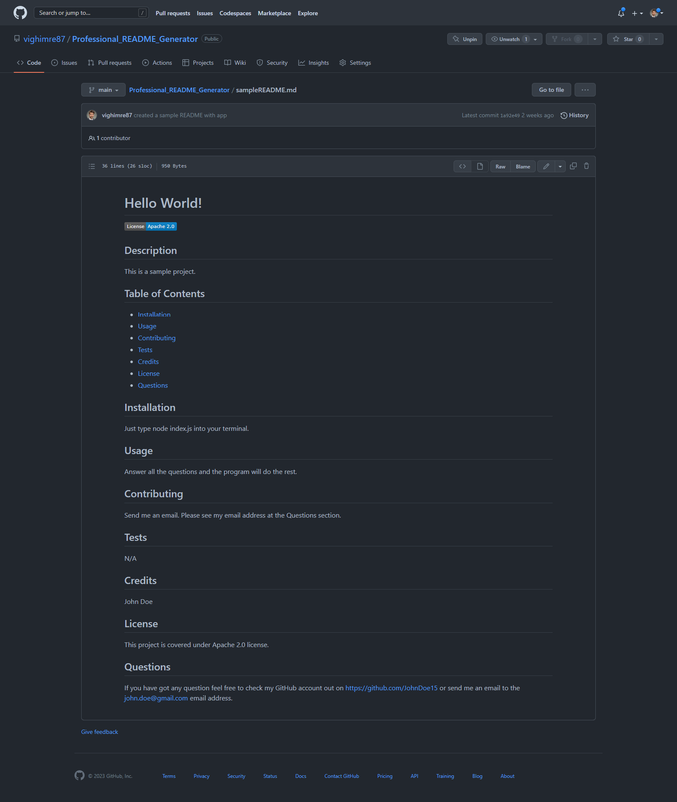

# Professional README Generator

  [](https://opensource.org/licenses/MIT)

  ## Description
  This is a simple Node JS console application which let you generate README files quickly and easily so you can spend more time working on your project.

  ## Table of Contents
  - [Installation](#installation)
  - [Usage](#usage)
  - [Contributing](#contributing)
  - [Tests](#tests)
  - [Credits](#credits)
  - [License](#license)
  - [Questions](#questions)

  ## Installation
  1. Download the master folder from GitHub or clone the project folder to your local machine
  2. In order to run the script files you will need Node JS (I used v18.14.1) and Inquirer.js package from npm (I used v9.1.4). If you haven't got them, install them on your computer.
  3. Run the script files with the following prompt:
  ```
  node index.js
  ```

  ## Usage
  Once you run the index.js file through the command line, it will ask you questions about your project. As a user you will be asked about the title of the project, a brief description of the project, installation instructions, usage information, contribution guidelines and test instructions. You will also get question on who was working on your project, what license is your project covered under and what is your GitHub username and email address. Once you answered all the questions a professional README file will be created.
  The README file will contain the title of the project and the following sections: Description, Table of Contents, Installation, Usage, License, Contributing, Tests, Questions. Once you click the links in the Table of Contents you will be taken to the corresponding section of the README. When you choose a license from the list of the options a badge will be added at the top of the README and a notice will be created and added to the section of the README entitled License that explains which license is the application is covered under. When you enter your GitHub username it will be added to the Questions section of the README with a link to your GitHub profile. When you enter your email address then it will also be added to the Questions section of the README file with instructions on how to reach you with additional questions.

  You can watch a video demonstration of the application on the following link: https://drive.google.com/file/d/1jD_0JfG3poO4WKzZhTTz0yxSuMPwQphu/view.

  You can also see a sample README file in the repo that has been created with the application. Please refer to the sampleREADME.md file. Please see a mockup image of the sample README file below:

  

  ## Contributing
  Any contribution is greatly appreciated.
  If you have any suggestion that would make this project better, please fork the repo and create a pull request. You can also just open an issue with the "enhancement". And also don't forget to give a star to the project!
  1. Fork the Project
  2. Create your Feature Branch (git checkout -b [featurebranch])
  3. Commit your Changes (git commit -m '[add your message here]')
  4. Push to the Branch (git push origin [featurebranch])
  5. Open a Pull Request

  ## Tests
  N/A

  ## Credits
  Imre Vigh

  ## License
  This project is covered under MIT license.

  ## Questions
  If you have got any question feel free to check out my GitHub account on https://github.com/vighimre87 or send me an email to the [vighimre87@gmail.com](mailto:vighimre87@gmail.com) email address.
